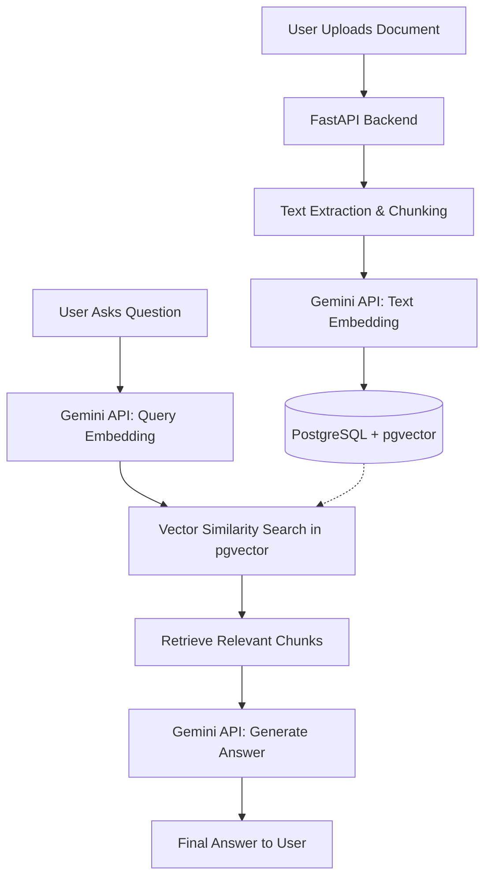

# Smart Document Agent: Enterprise-Grade RAG Pipeline

A production-ready AI solution that transforms static, unstructured data (PDFs, DOCXs, CSVs) into actionable, queryable insights using Google's Gemini AI and PostgreSQL vector search. 

## The Problem
Enterprise teams lose countless hours manually searching through dense, unstructured documents—legal contracts, technical manuals, and financial reports. Standard keyword search fails to understand context, nuance, or the semantic meaning behind user queries, leading to frustrated employees, lost productivity, and missed insights.

## The Solution & Business Impact
Smart Document Agent implements a state-of-the-art **Retrieval-Augmented Generation (RAG)** pipeline designed for business efficiency. 
- **Drastically Reduced Discovery Time:** Instantly locate exact clauses or context buried in hundreds of pages.
- **Enterprise-Grade Privacy:** By storing vector embeddings in a self-hosted PostgreSQL database using `pgvector`, sensitive document context remains under your infrastructure's control, rather than relying on black-box external databases.
- **Scalability:** Capable of handling massive document loads with smart chunking, dynamic context switching (full-text vs. chunk-based retrieval based on size), and fast cosine similarity searches.
- **Structured Data Extraction & Comparison:** Automatically parses complex documents to return clean, structured JSON data mapped to specific source files, and holistically compares multiple documents.

## Architecture & Stack
- **Frontend:** React 18, Vite, Tailwind CSS 4
- **Backend:** Python 3.12+, FastAPI
- **Database & Vector Store:** PostgreSQL with the `pgvector` extension (via SQLAlchemy)
- **AI Engine:** Google Gemini (`gemini-3.5-flash` for generation, `gemini-embedding-001` for vector embeddings)
- **Deployment:** Dockerized database for frictionless environments

## Architecture Data Flow


## Frictionless Setup

### 1. Database Setup (Docker)
We use Docker to instantly spin up a PostgreSQL instance pre-configured with the `pgvector` extension. Ensure Docker is running, then execute:

```bash
docker-compose up -d
```
*This starts the `smart_agent_db` container and exposes it on port 5433.*

### 2. Configure Environment
Create a `.env` file in the `backend/` directory and add your API key:

```env
GEMINI_API_KEY=your_actual_gemini_api_key_here
```

### 3. Application Setup

**Option A: One-Click Setup (Windows)**
```bash
setup.bat
start.bat
```

**Option B: Manual Setup**
```bash
# Backend (Terminal 1)
cd backend
python -m venv venv
source venv/bin/activate      # Mac/Linux
.\venv\Scripts\activate       # Windows
pip install -r requirements.txt
python run.py                 # Runs on http://127.0.0.1:8000

# Frontend (Terminal 2)
cd frontend
npm install
npm run dev                   # Runs on http://localhost:5173
```

### 4. Usage
1. Open **http://localhost:5173** in your browser.
2. Click **"+ New Workspace"** to create a session.
3. Upload a document (PDF, TXT, CSV, DOCX, or XLSX).
4. Once processed, type a question in the chat input. The AI will securely search your document embeddings and provide a highly contextual answer.

## License
Proprietary. Copyright (c) 2026 Rohan Khedekar. All rights reserved.
