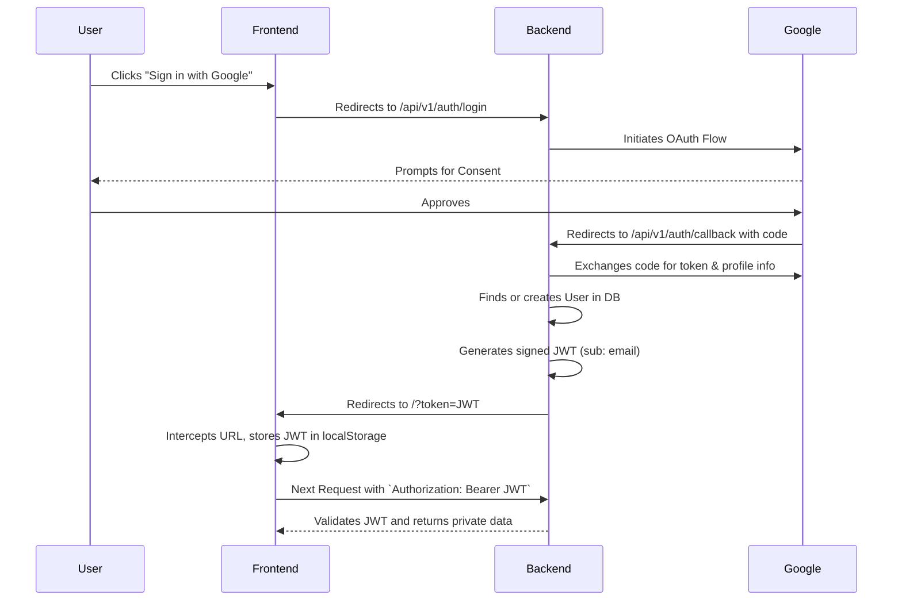
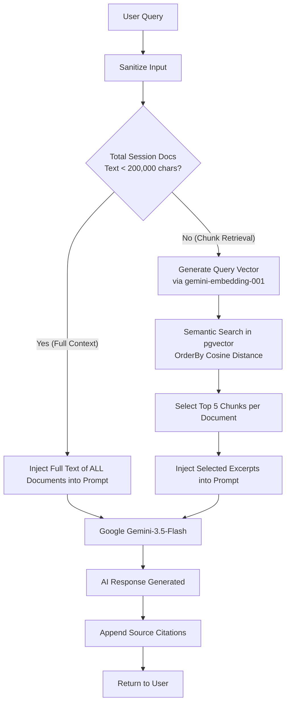

# System Architecture & Design

Smart Document Agent is a modern, modular document intelligence platform that provides advanced document analysis using AI. It utilizes a Retrieval-Augmented Generation (RAG) architecture with semantic vector search.

## Tech Stack Overview

- **Frontend:** React 18, Vite, Tailwind CSS v4, Lucide Icons, Axios.
- **Backend:** Python 3.12+, FastAPI, SQLAlchemy, SlowAPI (rate limiting).
- **Database & Vector Store:** PostgreSQL with pgvector extension (unified storage for relational metadata and 768-dimensional text embeddings).
- **AI/LLM Engine:** Google Gemini SDK (`gemini-3.5-flash` for generation/summarization, `gemini-embedding-001` for vectors).
- **Authentication:** Google OAuth2 (via Authlib) with JWT tokens stored in localStorage (and legacy HttpOnly cookie fallback).

---

## High-Level Architecture

The system is separated into a frontend client and a RESTful backend API.

---

## Authentication Flow

To support modern browser security policies (especially on mobile browsers that block third-party cookies), the application uses a token-based authentication flow.

---

## Database Schema

The database manages persistent entities using SQLAlchemy ORM.

### Models

#### `User`
Represents a registered user authenticated via Google OAuth.
- `id` (Integer, PK)
- `email` (String, Unique, Index)
- `name` (String)
- `picture` (String)
- `created_at` (DateTime)

#### `Session`
Represents a distinct workspace or chat thread owned by a user.
- `id` (String, PK, UUID)
- `name` (String)
- `user_id` (Integer, FK -> users.id)
- `created_at` (DateTime)

#### `Document`
Tracks files uploaded to a specific session.
- `id` (Integer, PK)
- `session_id` (String, FK -> sessions.id)
- `filename` (String)
- `extracted_text` (String)
- `created_at` (DateTime)

#### `DocumentChunk`
Stores text chunks with their high-dimensional embeddings for semantic search.
- `id` (Integer, PK)
- `document_id` (Integer, FK -> documents.id)
- `session_id` (String, FK -> sessions.id)
- `filename` (String)
- `text` (String)
- `embedding` (Vector(768))
- `created_at` (DateTime)

#### `Message`
Stores the chat history.
- `id` (Integer, PK)
- `session_id` (String, FK -> sessions.id)
- `sender` (String) - Either "user" or "ai".
- `text` (String)
- `created_at` (DateTime)

---

## RAG Pipeline (Retrieval-Augmented Generation)

To overcome LLM context limits and reduce token costs, the application employs a targeted semantic retrieval pipeline, with a full-text fallback for smaller document sets.

### 1. Ingestion Phase (`document_service.py` & `routes.py`)
1. **Upload:** User uploads a file (validated dynamically in chunks up to 10MB). Supported formats: `.pdf`, `.txt`, `.csv`, `.docx`, `.xlsx`.
2. **Parsing:** Text is extracted using format-specific libraries (`pypdf`, `python-docx`, `openpyxl`).
3. **Chunking:** Text is split into chunks of 1000 characters with a 200-character overlap to preserve context boundaries.
4. **Embedding:** Each chunk is sent to Gemini's embedding model to generate a high-dimensional vector.
5. **Storage:** Chunks and their corresponding vectors are saved to PostgreSQL in the `document_chunks` table.
6. **Auto-Summary:** The first 3000 characters are sent to Gemini to generate an instant "Document Summary" card.

### 2. Retrieval & Generation Phase (`rag_service.py`)
Used in Chat, Data Extraction, and Document Comparison.

1. **Query Sanitization:** The user's input query is sanitized (truncated, null bytes removed, markdown fences escaped) to prevent prompt injection.
2. **Dynamic Context Strategy:**
   - **Full Context:** If the total character count of all documents in the session is under 200,000 characters, the *entire text* of all documents is injected into the prompt for maximum comprehension.
   - **Targeted Retrieval:** If the text exceeds the limit, the user's prompt is embedded into a vector, and pgvector cosine distance (`<=>`) is used to retrieve the **Top 5 most relevant chunks per document**.
3. **Generation:** The context is injected into a prompt template alongside the user's query and recent chat history, then sent to `gemini-3.5-flash`.
4. **Citations:** The response is returned to the user, strictly citing the source filenames of the injected documents.

---

## Security & Deployment Considerations
- **Environment Separation:** API credentials and JWT secrets are managed dynamically via `.env`.
- **Access Control:** Every database operation is scoped to the authenticated user's ID to prevent IDOR (Insecure Direct Object Reference).
- **Rate Limiting:** Protects endpoints from resource exhaustion using `slowapi`.
- **Production Path:**
  - Standard deployment via Docker or native Python on PaaS providers like Render.
  - See `docs/DEPLOYMENT.md` for specific host setup instructions.
