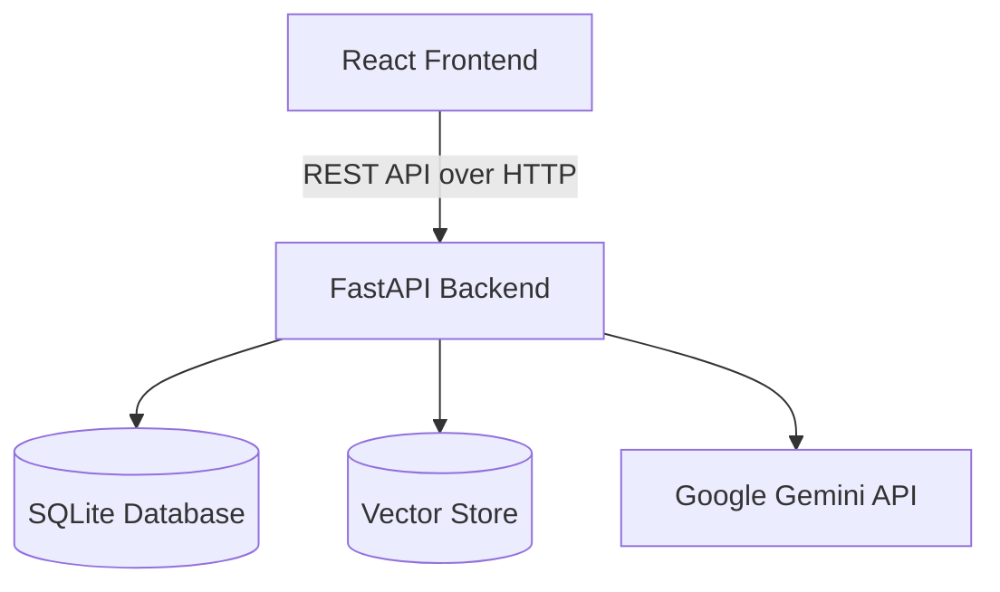

# System Architecture & Design

The Smart Document Agent is a modern, modular application designed to provide advanced document analysis using AI. It utilizes a Retrieval-Augmented Generation (RAG) architecture with semantic vector search.

## Tech Stack Overview

- **Frontend:** React 18, Vite, Tailwind CSS v4, Lucide Icons, Axios.
- **Backend:** Python 3.10+, FastAPI, SQLAlchemy.
- **Database:** SQLite (local persistence, easily migratable to PostgreSQL).
- **AI/LLM Engine:** Google Gemini SDK (`gemini-2.5-flash` for generation, `text-embedding-004` for vectors).
- **Vector Store:** Custom pure-Python cosine similarity search over `vector_store.json`.

---

## High-Level Architecture

The system is separated into a frontend client and a RESTful backend API.

---

## Database Schema

The relational database (`app.db`) manages persistent entities using SQLAlchemy ORM.

### Models

#### `Session`
Represents a distinct workspace or chat thread.
- `id` (String, PK, UUID)
- `name` (String)
- `created_at` (DateTime)

#### `Document`
Tracks files uploaded to a specific session.
- `id` (Integer, PK)
- `filename` (String)
- `session_id` (String, FK -> Session.id)
- `created_at` (DateTime)

#### `Message`
Stores the chat history.
- `id` (Integer, PK)
- `session_id` (String, FK -> Session.id)
- `sender` (String) - Either "user" or "ai".
- `text` (String)
- `created_at` (DateTime)

---

## RAG Pipeline (Retrieval-Augmented Generation)

To overcome LLM context limits and reduce token costs, the application employs a targeted semantic retrieval pipeline.

### 1. Ingestion Phase (`document_service.py`)
1. **Upload:** User uploads a PDF, TXT, or CSV file.
2. **Parsing:** Text is extracted (using `pypdf` for PDFs).
3. **Chunking:** Text is split into chunks of 1000 characters with a 200-character overlap to preserve context boundaries.
4. **Embedding:** Each chunk is sent to Gemini's embedding model to generate a high-dimensional vector.
5. **Storage:** Chunks and their corresponding vectors are saved to the local `vector_store.json`.
6. **Auto-Summary:** The first 3000 characters are sent to Gemini to generate an instant "Document Summary" card.

### 2. Retrieval Phase (`rag_service.py`)
Used in Chat, Data Extraction, and Document Comparison.

1. **Query Embedding:** The user's prompt is embedded into a vector.
2. **Cosine Similarity Search:** The system calculates the mathematical distance between the query vector and all chunk vectors in the current session.
3. **Filtering & Ranking:**
   - For **Chat**: Retrieves the top 3 most relevant chunks across all documents.
   - For **Extraction**: Retrieves the top 5 most relevant chunks across all documents.
   - For **Comparison**: Filters by specific filenames, retrieving the top 4 chunks from Document A and top 4 from Document B.
4. **Generation:** The highly relevant text chunks are injected into a prompt template alongside the user's query and sent to Gemini Flash.
5. **Citations:** The response is returned to the user, strictly citing the source filenames of the injected chunks.

---

## Security & Deployment Considerations
- **Current State:** Designed for local, single-tenant usage. Vector data and chat history are stored on the local filesystem.
- **Production Path:**
  - Migrate SQLite to PostgreSQL.
  - Migrate `vector_store.json` to a dedicated vector database (e.g., pgvector, Chroma, Pinecone).
  - Implement Authentication (e.g., OAuth2 / JWT) on the FastAPI routes.
  - Containerize using Docker and deploy to Google Cloud Run.
