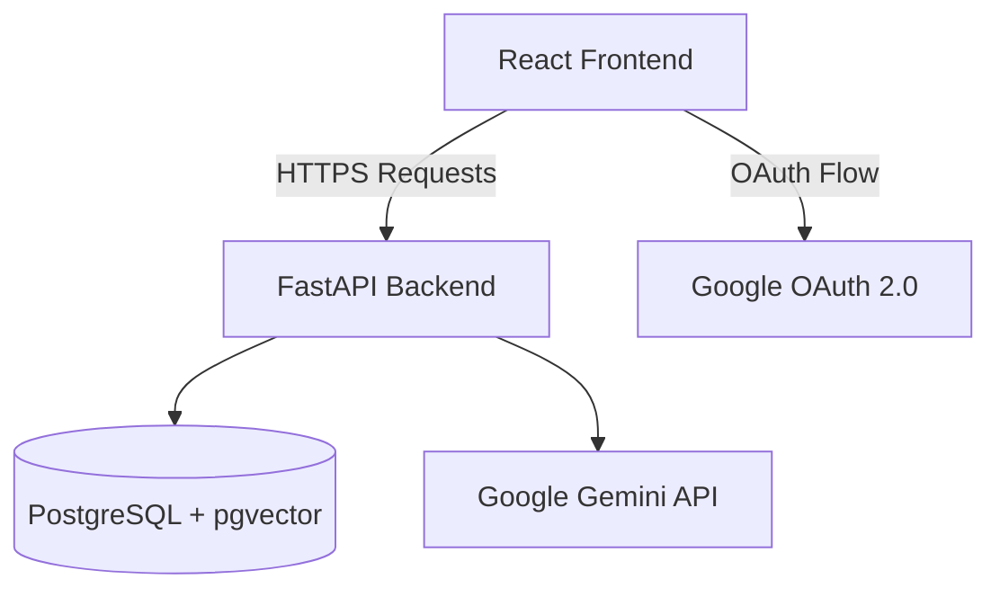

# System Architecture & Design

Smart Document Agent is a modern, modular document intelligence platform that provides advanced document analysis using AI. It utilizes a Retrieval-Augmented Generation (RAG) architecture with semantic vector search.

## Tech Stack Overview

- **Frontend:** React 18, Vite, Tailwind CSS v4, Lucide Icons, Axios.
- **Backend:** Python 3.12+, FastAPI, SQLAlchemy, SlowAPI (rate limiting).
- **Database & Vector Store:** PostgreSQL with pgvector extension (unified storage for relational metadata and 768-dimensional text embeddings).
- **AI/LLM Engine:** Google Gemini SDK (`gemini-2.5-flash` for generation/summarization, `text-embedding-004` for vectors).
- **Authentication:** Google OAuth2 (via Authlib) and HttpOnly JWT session cookies.

---

## High-Level Architecture

The system is separated into a frontend client and a RESTful backend API.

---

## Database Schema

The database manages persistent entities using SQLAlchemy ORM.

### Models

#### `User`
Represents a registered user authenticated via Google OAuth.
- `id` (Integer, PK)
- `email` (String, Unique, Index)
- `name` (String)
- `picture` (String)
- `created_at` (DateTime)

#### `Session`
Represents a distinct workspace or chat thread owned by a user.
- `id` (String, PK, UUID)
- `name` (String)
- `user_id` (Integer, FK -> users.id)
- `created_at` (DateTime)

#### `Document`
Tracks files uploaded to a specific session.
- `id` (Integer, PK)
- `session_id` (String, FK -> sessions.id)
- `filename` (String)
- `extracted_text` (String)
- `created_at` (DateTime)

#### `DocumentChunk`
Stores text chunks with their high-dimensional embeddings for semantic search.
- `id` (Integer, PK)
- `document_id` (Integer, FK -> documents.id)
- `session_id` (String, FK -> sessions.id)
- `filename` (String)
- `text` (String)
- `embedding` (Vector(768))
- `created_at` (DateTime)

#### `Message`
Stores the chat history.
- `id` (Integer, PK)
- `session_id` (String, FK -> sessions.id)
- `sender` (String) - Either "user" or "ai".
- `text` (String)
- `created_at` (DateTime)

---

## RAG Pipeline (Retrieval-Augmented Generation)

To overcome LLM context limits and reduce token costs, the application employs a targeted semantic retrieval pipeline.

### 1. Ingestion Phase (`document_service.py` & `routes.py`)
1. **Upload:** User uploads a PDF, TXT, CSV, DOCX, or XLSX file (size validated dynamically in chunks up to 10MB).
2. **Parsing:** Text is extracted using format-specific libraries (`pypdf` for PDFs, `python-docx` for Word, `openpyxl` for Excel).
3. **Chunking:** Text is split into chunks of 1000 characters with a 200-character overlap to preserve context boundaries.
4. **Embedding:** Each chunk is sent to Gemini's embedding model to generate a high-dimensional vector.
5. **Storage:** Chunks and their corresponding vectors are saved to the PostgreSQL database in the `document_chunks` table.
6. **Auto-Summary:** The first 3000 characters are sent to Gemini to generate an instant "Document Summary" card.

### 2. Retrieval & Generation Phase (`rag_service.py`)
Used in Chat, Data Extraction, and Document Comparison.

1. **Query Sanitization:** The user's input query is sanitized (truncated, null bytes removed, markdown fences escaped) to prevent prompt injection.
2. **Query Embedding:** The user's prompt is embedded into a vector.
3. **Semantic Similarity Search:** The system uses pgvector's cosine distance operator (`<=>`) to query the database.
4. **Filtering & Ranking:**
   - **Chat:** Retrieves the top 3 most relevant chunks across all documents.
   - **Extraction:** Retrieves the top 5 most relevant chunks across all documents.
   - **Comparison:** Filters by specific filenames, retrieving the top 4 chunks from Document A and top 4 from Document B.
5. **Generation:** The highly relevant text chunks are injected into a prompt template alongside the user's query and sent to Gemini Flash.
6. **Citations:** The response is returned to the user, strictly citing the source filenames of the injected chunks.

---

## Security & Deployment Considerations
- **Environment Separation:** API credentials, JWT secrets, and session secrets are managed dynamically via `.env`.
- **Access Control:** Every database operation is scoped to the authenticated user's ID to prevent IDOR (Insecure Direct Object Reference).
- **Rate Limiting:** Protects the endpoints from resource exhaustion using slowapi.
- **Production Path:**
  - Configure backend and database services using the provided `docker-compose.yml`.
  - Ensure HTTPS is terminated at the load balancer or proxy to secure the HttpOnly session cookies.
